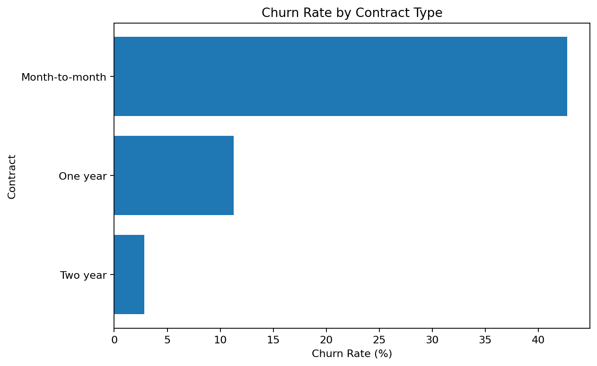
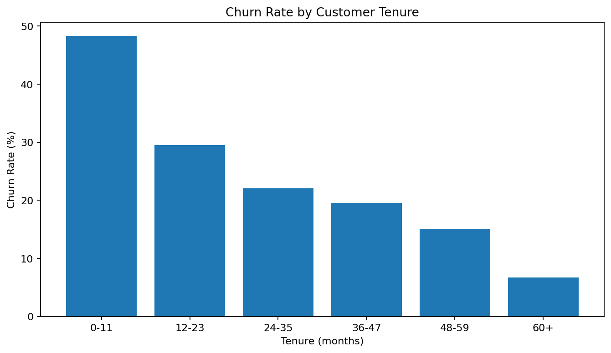
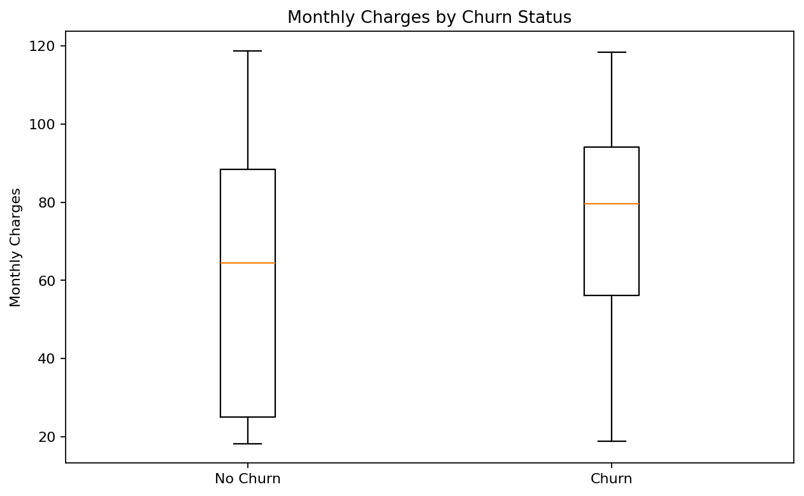
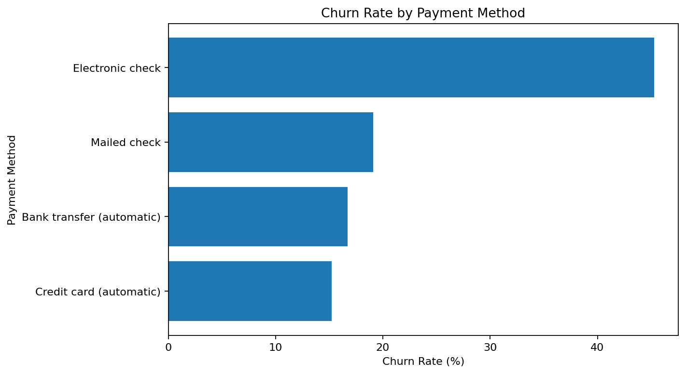
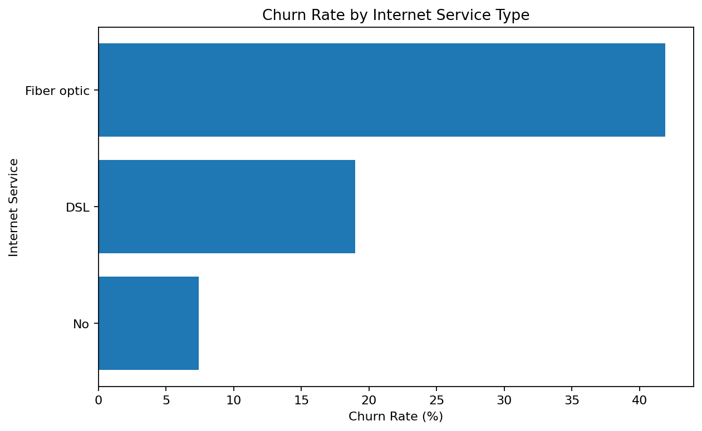
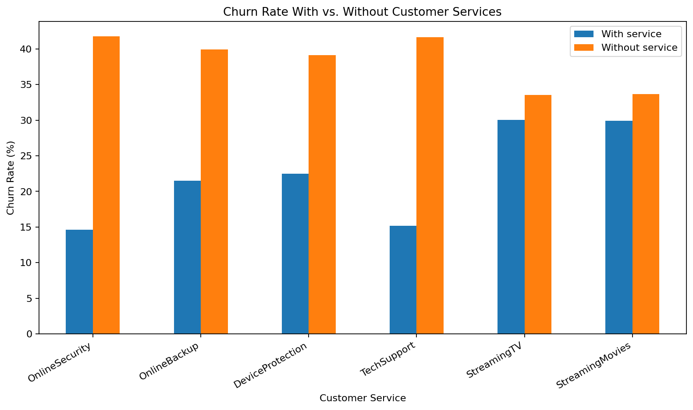

# Customer Churn Analysis

Exploratory data analysis project focused on identifying patterns associated with customer churn using **Python**, **Pandas**, and **Matplotlib**.

The project analyzes a dataset with **7,043 customers** and explores how churn varies across contract types, tenure, monthly charges, payment methods, internet services, and additional customer services.

## Key Findings

- **Overall churn rate:** 26.54%
- **Month-to-month contracts:** 42.71% churn
- **Two-year contracts:** 2.83% churn
- **Customers with 0–11 months of tenure:** 48.28% churn
- **Electronic check:** 45.29% churn
- **Fiber optic internet:** 41.89% churn
- **Online Security** and **Tech Support** are associated with noticeably lower churn rates

> These results describe associations in the dataset and should not be interpreted as proof of causation.

## Visual Analysis

### Churn by Contract Type



Month-to-month customers have the highest churn rate, while customers on longer contracts show much lower churn.

### Churn by Customer Tenure



Churn is highest among customers with shorter tenure and generally decreases as tenure increases.

### Monthly Charges and Churn



Customers who churn tend to have higher monthly charges on average, although other factors may also explain this relationship.

### Churn by Payment Method



Electronic check customers show the highest churn rate among the payment methods in the dataset.

### Churn by Internet Service



Fiber optic customers have a substantially higher churn rate than DSL customers.

### Customer Services and Churn



Online Security and Tech Support stand out as services associated with lower churn rates.

## Questions Explored

The notebook `Examples.ipynb` answers the following questions:

1. Which contract types have the highest churn rate?
2. Is churn higher among customers with shorter tenure?
3. Is there a relationship between monthly charges and churn?
4. Which payment methods are associated with higher churn?
5. Does internet service type influence churn?
6. Which customer services appear to be associated with lower churn?

The notebook is saved with its outputs, so the analysis and graphs can be viewed directly on GitHub without rerunning the cells.

## Technologies

- Python
- Pandas
- Matplotlib
- Jupyter Notebook

## Project Structure

```text
.
├── churn_data.csv
├── main.py
├── Examples.ipynb
├── README.md
├── requirements.txt
└── images/
    ├── churn_by_contract.png
    ├── churn_by_internet.png
    ├── churn_by_payment.png
    ├── churn_by_services.png
    ├── churn_by_tenure.png
    └── monthly_charges_vs_churn.png
```

## Data Preparation

The `TotalCharges` column is loaded as text because the raw dataset contains blank values.

It is converted to a numeric column using:

```python
df["TotalCharges"] = pd.to_numeric(
    df["TotalCharges"],
    errors="coerce"
)
```

The `CustomerID` column is treated only as an identifier and is not used as an analytical feature.

## Installation

Clone the repository:

```bash
git clone https://github.com/Lc-1290/Churn-Analysis
```

Create a virtual environment:

```bash
python -m venv venv
```

Activate it on Windows:

```bash
venv\Scripts\activate
```

On Linux/macOS:

```bash
source venv/bin/activate
```

Install the dependencies:

```bash
pip install -r requirements.txt
```

## Requirements

A minimal `requirements.txt` can contain:

```text
pandas
matplotlib
jupyter
```

## Running the Analysis

To open the notebook locally:

```bash
jupyter notebook Examples.ipynb
```

You can also run the Python script directly if the project includes analysis calls in `main.py`:

```bash
python main.py
```

## Limitations

This project is an exploratory data analysis.

Differences in churn between customer groups do not necessarily mean that one variable directly causes churn. Several variables may be related to each other.

For example, monthly charges may vary with contract type, internet service, and additional services.

## Possible Next Steps

- Statistical significance tests
- Cross-tabulation of important variables
- Logistic regression
- Feature engineering
- Churn prediction models
- Precision, recall, F1-score, and ROC-AUC evaluation
- Interactive dashboard

## AUTHOR

**Luis Felipe**

- Github: (https://github.com/Lc-1290)